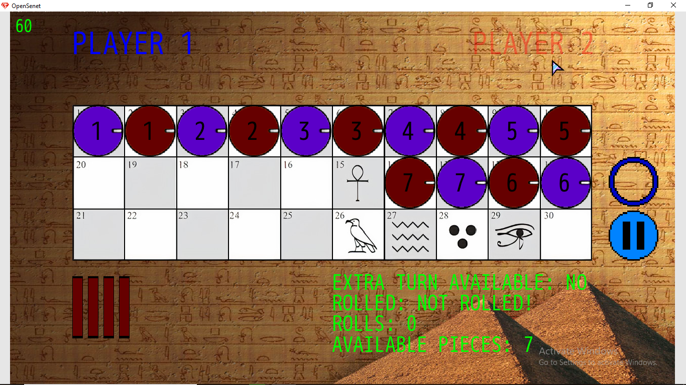
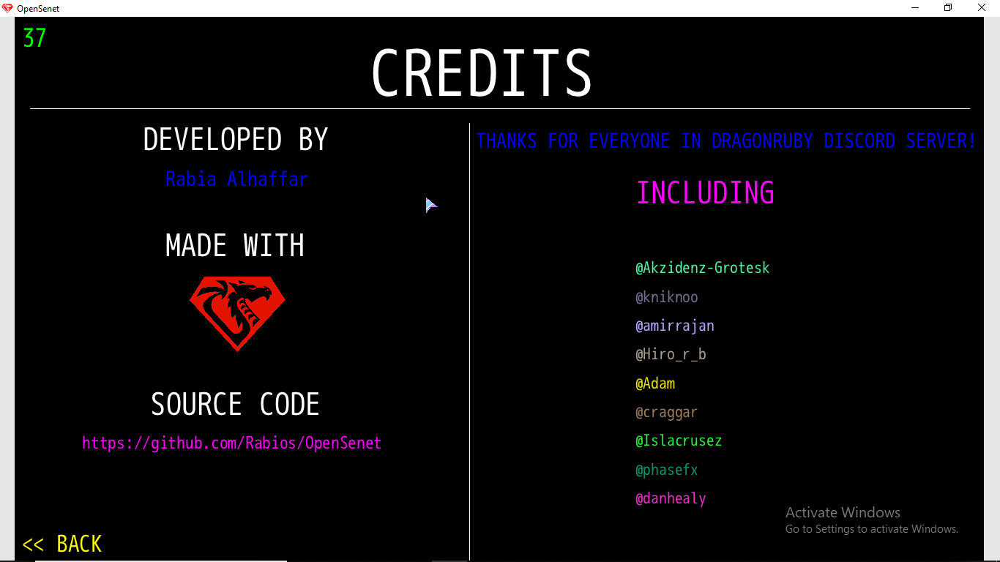

# OpenSenet

OpenSenet is [Senet](https://en.wikipedia.org/wiki/Senet) board game written in [Ruby](https://www.ruby-lang.org) via [DragonRuby GTK](https://dragonruby.itch.io/dragonruby-gtk)!

OpenSenet was done in around 18 days, And will still be better each day!

The goal was to provide open source and free Senet game running on most desktop operating systems that isn't being made with engines like Unity.

### Screenshots

  
  

### How to play?

1. Click on sticks to roll it.

2. Click on piece to select it and click on one possible moves (one of green circles), To deselect piece use right mouse button.

3. You can click on the ring or hit space key to pass turn if no piece of player pieces can move on board.

About Senet rules, You can find it [here!](http://www.pjhoover.com/senet.php)

### Changes from original Senet

1. Player can select to move his pieces backward or forward if possible...
2. Player also can pass turn manually.

### Where to play and download?

See the game page on itch.io [here!](https://rabios.itch.io/opensenet)

### License

Game licensed under MIT license.

About 3rd party stuff, It's mentioned in [`info.txt`](https://github.com/Rabios/OpenSenet/blob/main/info.txt).

### Support

If you found bugs, Submit issues descriping bugs you found...